# DSA Visuals Guide — ASCII, Mermaid, Flowcharts & Optional GIF

> **Purpose:** Reference-only lookup for Mermaid templates and visual suggestions per DSA week. Not required reading — `.agent.md §4` contains all the rules you need for generation.  
> **Companion:** [.agent.md](../.agent.md) · [RUBRIC.md](./RUBRIC.md)

---

## §1 — Baseline Requirements (Mandatory)

Every DSA `CODE.md` must include:

| Visual Type | Where | Format | Required |
|------------|-------|--------|----------|
| Traversal block | Under each snippet's expected output | ASCII step-by-step | ✅ Always |
| Algorithm-decision flowchart | Visual/Diagram section | Mermaid `flowchart` | ✅ Always |
| Step-by-step traversal diagram | Visual/Diagram section | Mermaid or ASCII | ✅ Always |
| Complexity comparison chart | Visual/Diagram section | ASCII table | ✅ Always |
| Section-level structure diagram | Visual/Diagram section | ASCII or Mermaid | ✅ Always |
| GIF animation | Visual/Diagram section | `.gif` with caption | ⭐ Optional |

**Minimum per DSA `CODE.md`:** 3 diagrams in the Visual/Diagram section:
1. One **algorithm-decision flowchart** (when to use which approach)
2. One **step-by-step traversal** (how the algorithm processes data)
3. One **complexity comparison chart** (brute vs optimal)

---

## §2 — Mermaid Rendering Notes

Mermaid renders natively on **GitHub**, **GitLab**, **Notion**, and **VS Code** (with extensions).

### Flowchart Syntax Quick Reference

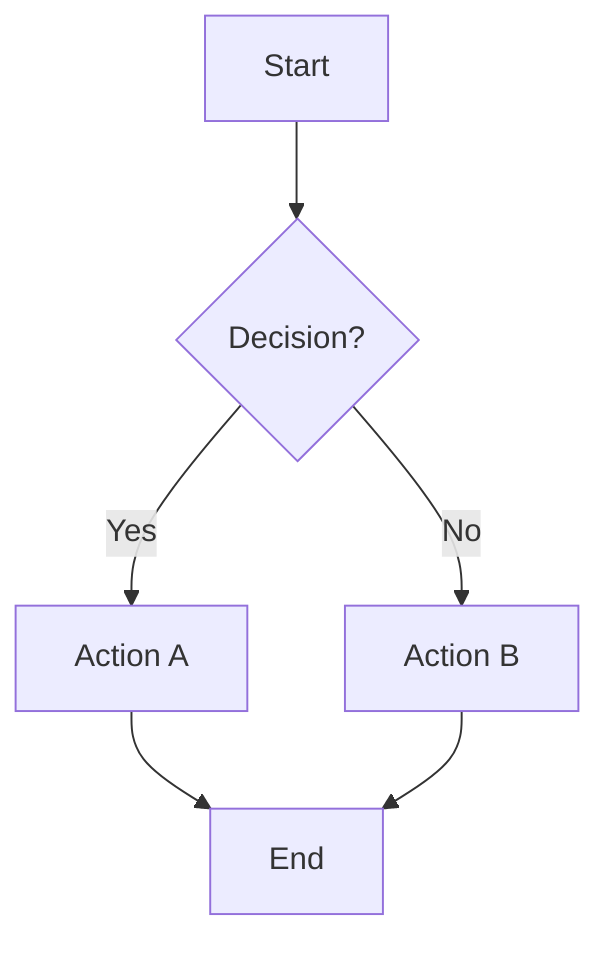

### Style Guide for DSA Flowcharts

| Node Type | Shape | Color | Example |
|-----------|-------|-------|---------|
| Start/Input | `[rectangle]` | Default | `A[Read array]` |
| Decision | `{diamond}` | Default | `B{Element in set?}` |
| Success/Return | `[rectangle]` | Green `fill:#2d6` | `C[Return result]` |
| Failure/Error | `[rectangle]` | Red `fill:#d44` | `D[Raise error]` |
| Process step | `[rectangle]` | Default | `E[Update pointer]` |
| Data structure | `([rounded])` | Blue `fill:#26d` | `F([Hash Map])` |

### ASCII Fallback Rule

Every Mermaid diagram must have an ASCII fallback **above or below** it for portability:

```text
[ASCII version of the same diagram]
```

```mermaid
flowchart ...
[Mermaid version]
```

---

## §3 — Snippet-Level Traversal Template

Place this under every DSA snippet's expected output:

````markdown
**`function_name`** — one-line description.
```python
# code snippet
```
Expected output:
```text
function_name([input]) -> output
```
Complexity: `Time O(...)`, `Space O(...)`.
Traversal (graphical):
```text
input = [...]
state = {}
step1: read X -> action -> state={...}
step2: read Y -> action -> state={...}
...
stepN: condition met -> return result
```
> One-line insight about this pattern.
````

---

## §4 — Visual/Diagram Section Template

Place this section after all snippets, before Pitfalls:

````markdown
## Visual / Diagram

### Algorithm Decision Flowchart — [Topic Name]

```text
[ASCII decision tree fallback]
```

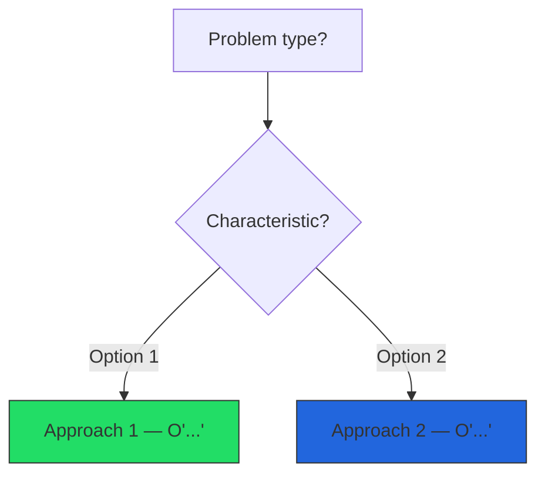

### Step-by-Step Traversal — [Algorithm Name]

```text
[ASCII step-by-step walkthrough]
```

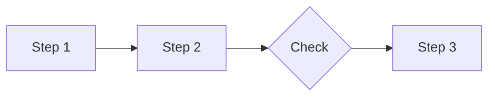

### Complexity Comparison Chart

```text
┌─────────────┬──────────┬──────────┬──────────────────┐
│ Problem      │ Brute    │ Optimal  │ Key insight       │
├─────────────┼──────────┼──────────┼──────────────────┤
│ Problem 1    │ O(n²)    │ O(n)     │ Insight here      │
│ Problem 2    │ O(n²)    │ O(n lg)  │ Insight here      │
└─────────────┴──────────┴──────────┴──────────────────┘
```
````

---

## §5 — Optional GIF Support

GIFs are optional and should only be used when they improve understanding (pointer movement, window shift, traversal order).

**If you add a GIF:**
- Keep ASCII/Mermaid fallback in the same section (mandatory).
- Add a one-line caption explaining what to observe.
- Prefer repo-local assets: `docs/assets/dsa_gifs/week_XX_topic.gif`.
- If using an external URL, include a stable source link in "Further reading".

```markdown


Caption: Observe how the pointer/window/traversal state changes each step.
Complexity tie-in: Time `O(...)`, Space `O(...)`.
```

---

## §6 — Per-Topic Flowchart Templates

Use these Mermaid templates as starting points for each DSA week's Visual/Diagram section.

### Week 01 — Arrays & Hashing: Data Structure Selection

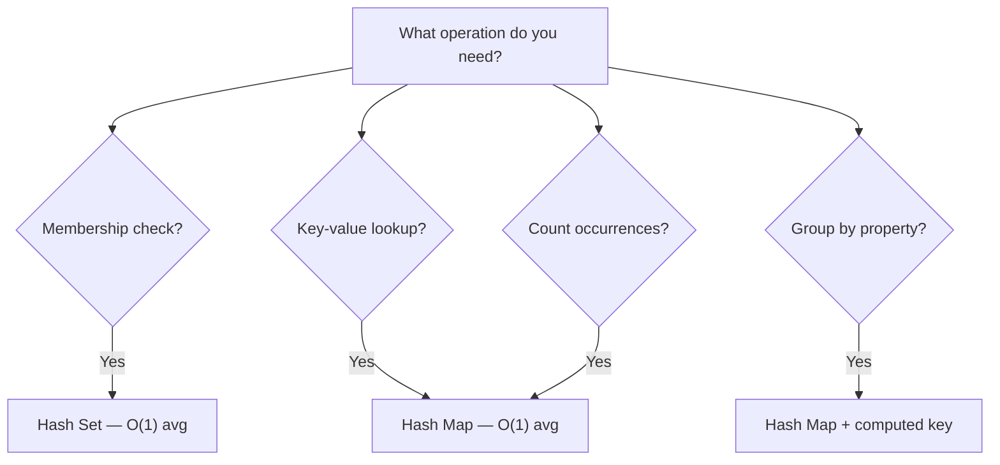

### Week 03 — Two Pointers: Pointer Movement

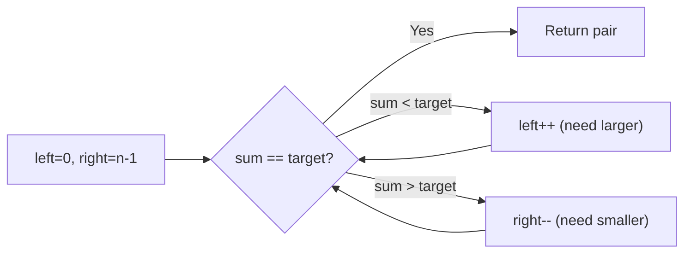

### Week 04 — Sliding Window: Window Expansion/Shrink

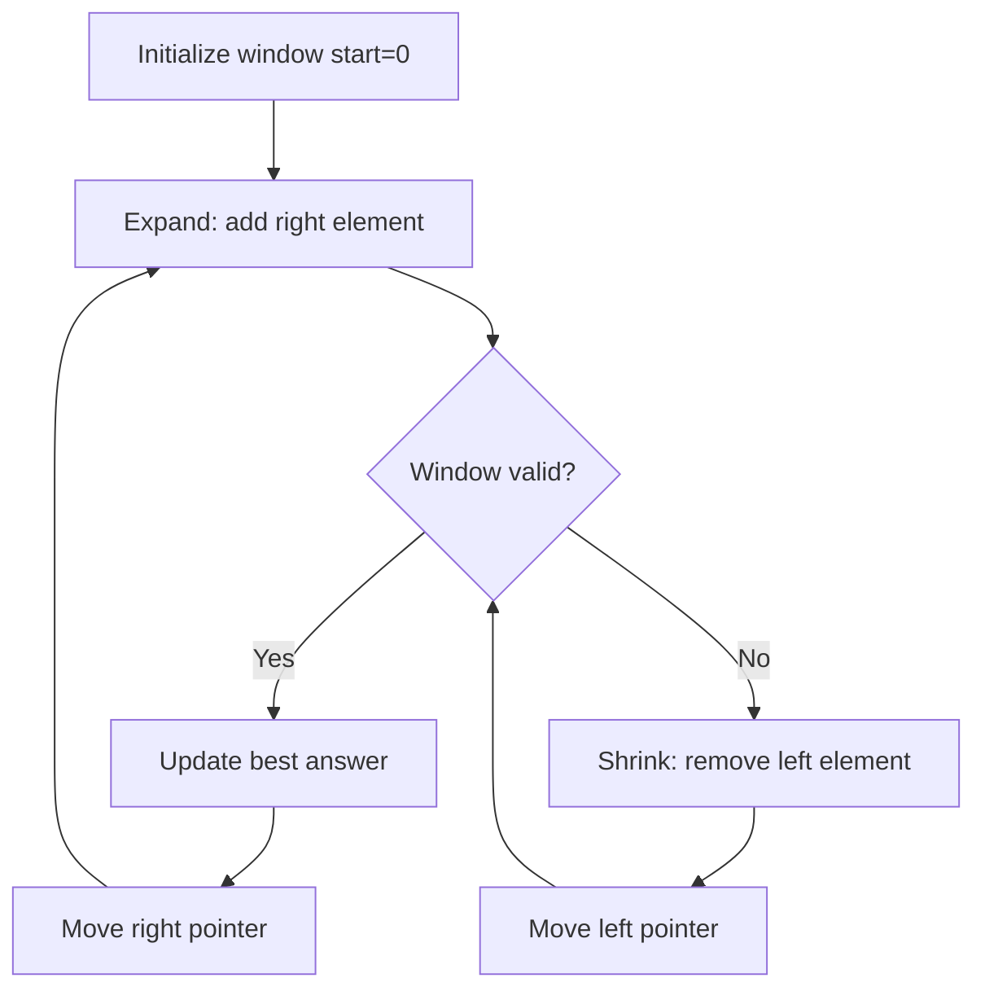

### Week 05 — Stack: Monotonic Stack Pattern

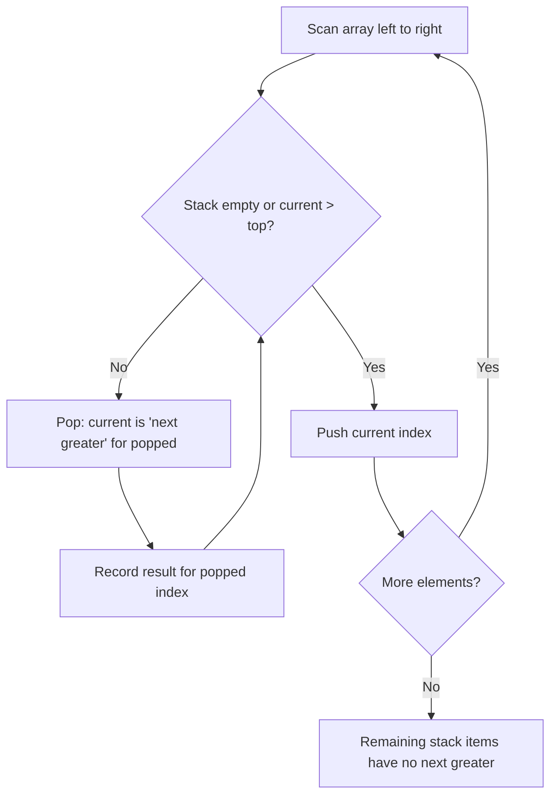

### Week 06 — Binary Search: Search Space Halving

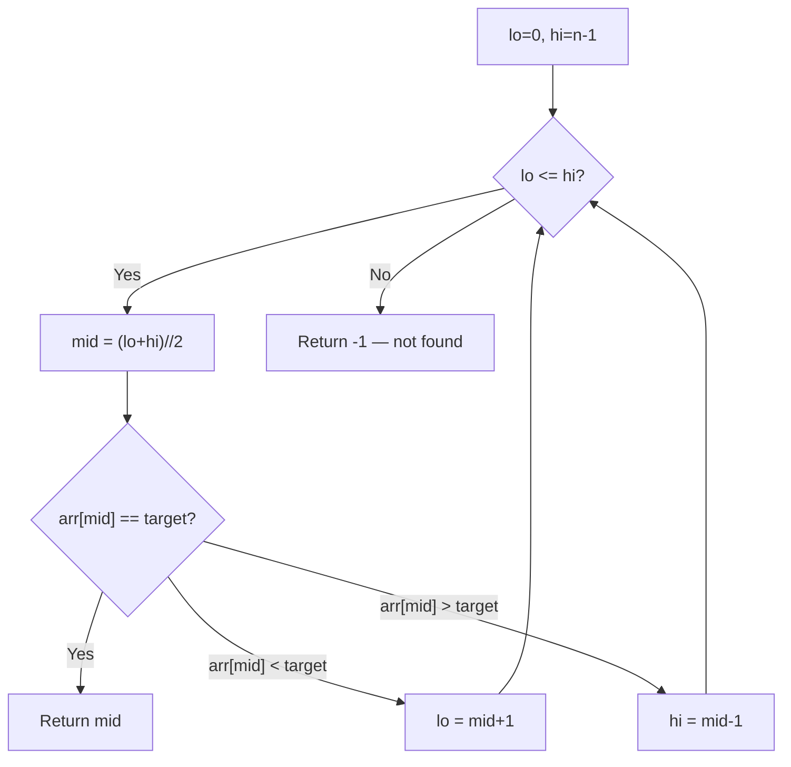

### Week 08 — Binary Tree: DFS vs BFS Decision

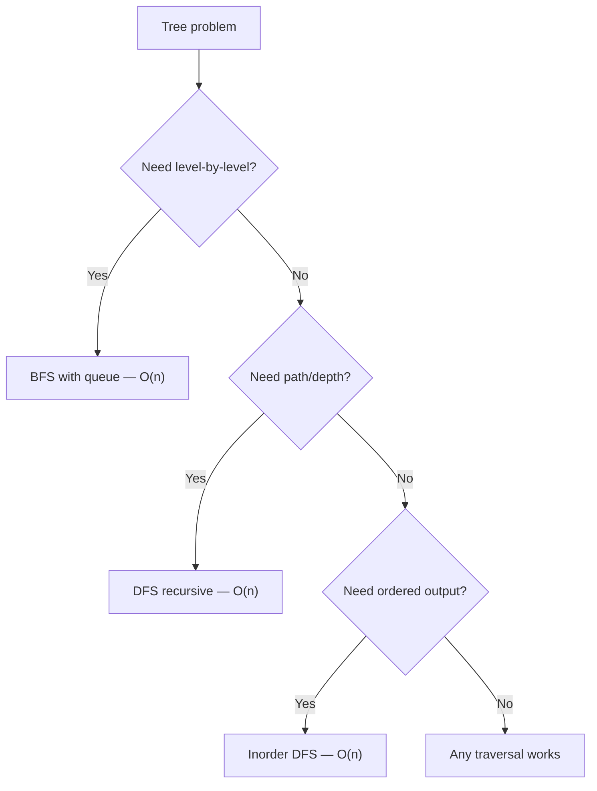

### Week 11 — Backtracking: Include/Exclude Tree

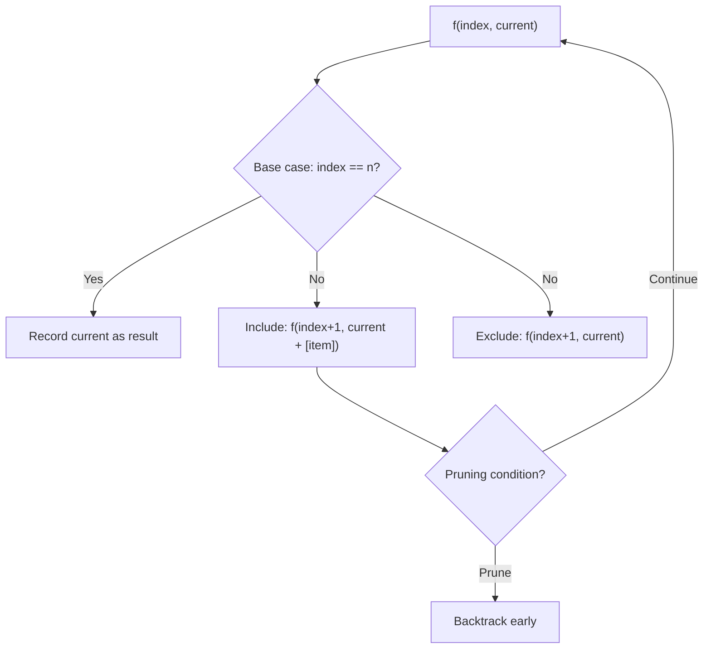

### Week 12 — Graphs: BFS/DFS Traversal

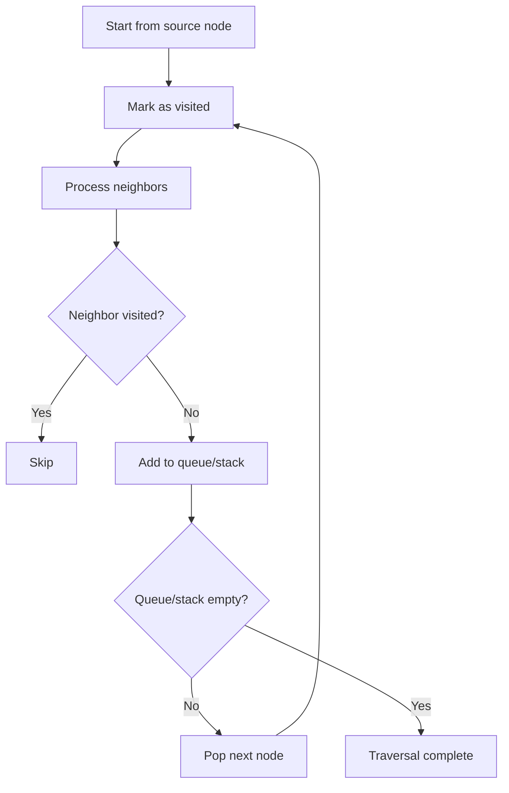

### Week 16 — DP: Memoization vs Tabulation

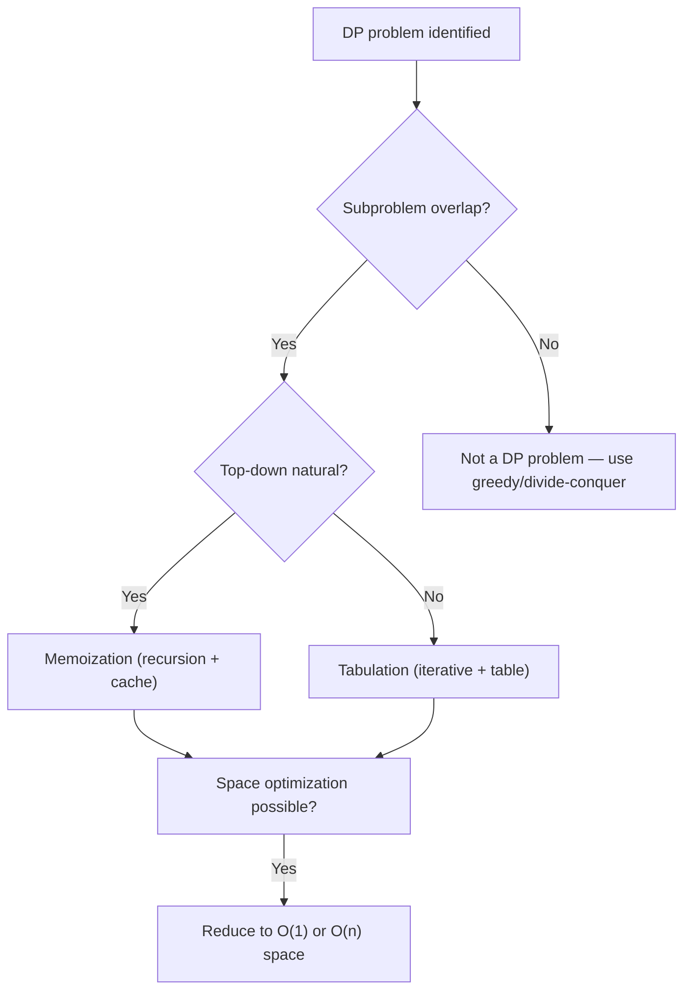

### Week 18 — Shortest Path: Algorithm Selection

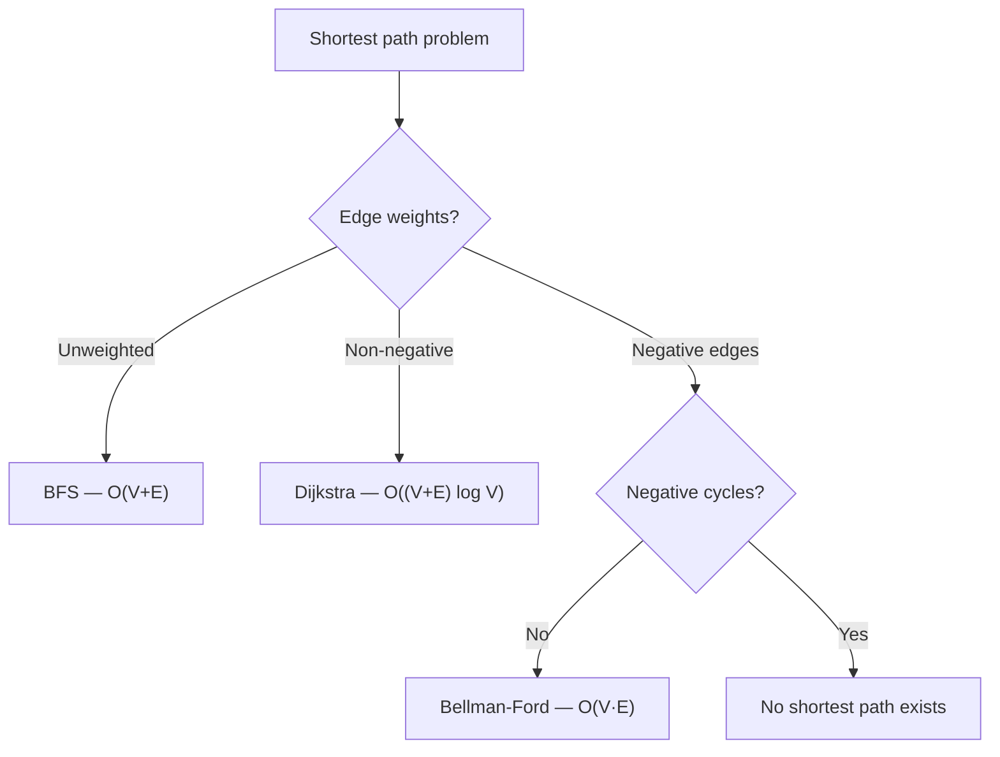

### Week 19 — Tries: Prefix Lookup

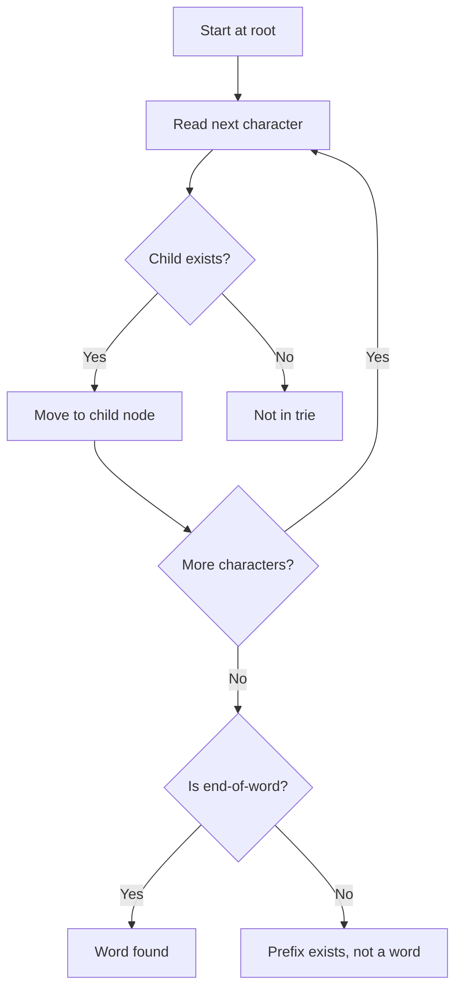

### Week 20 — Sorting: Algorithm Comparison

```text
┌──────────────┬──────────┬──────────┬──────────┬─────────┬───────────┐
│ Algorithm    │ Best     │ Average  │ Worst    │ Space   │ Stable?   │
├──────────────┼──────────┼──────────┼──────────┼─────────┼───────────┤
│ Merge Sort   │ O(n lg)  │ O(n lg)  │ O(n lg)  │ O(n)    │ ✅ Yes    │
│ Quick Sort   │ O(n lg)  │ O(n lg)  │ O(n²)    │ O(lg n) │ ❌ No     │
│ Heap Sort    │ O(n lg)  │ O(n lg)  │ O(n lg)  │ O(1)    │ ❌ No     │
│ Counting     │ O(n+k)   │ O(n+k)   │ O(n+k)   │ O(k)    │ ✅ Yes    │
│ Python sort  │ O(n)     │ O(n lg)  │ O(n lg)  │ O(n)    │ ✅ Yes    │
└──────────────┴──────────┴──────────┴──────────┴─────────┴───────────┘
```

---

## §7 — Placement Order Checklist

When building a DSA `CODE.md`, place visuals in this order:

1. ✅ **Snippet-level traversal** — under each snippet's expected output (§3)
2. ✅ **Algorithm-decision flowchart** — first diagram in Visual/Diagram (§6)
3. ✅ **Step-by-step traversal diagram** — second in Visual/Diagram
4. ✅ **Complexity comparison chart** — third in Visual/Diagram
5. ⭐ **Optional GIF** — last in Visual/Diagram, with ASCII/Mermaid above (§5)
6. ✅ **One-line complexity tie-in** — after each diagram

---

## §8 — Week-Specific Visual Suggestions

| Week | Topic | Recommended Visuals |
|------|-------|--------------------|
| 01 | Big-O, Arrays, Hashing | Data structure selection flowchart, two-sum walkthrough, complexity comparison table |
| 02 | Kadane, Prefix Sums | Running sum state diagram, Kadane's max-so-far tracker, prefix sum build animation |
| 03 | Two Pointers, 3Sum | Fixed `i` with `left`/`right` convergence, duplicate skipping decision tree |
| 04 | Sliding Window | Window expansion/shrink flowchart, deque front eviction diagram, window state tracker |
| 05 | Stack | Monotonic stack push/pop sequence, bracket matching state machine |
| 06 | Binary Search | Search space halving per step, rotated array pivot detection |
| 07 | Linked List | Node pointer diagrams, reversal step-by-step, fast/slow pointer positions |
| 08 | Binary Trees | Tree structure (Mermaid `graph TD`), DFS/BFS path highlighting, level-order fill |
| 09 | BST | BST validation range narrowing, inorder traversal sequence |
| 10 | Heap | Heap insert/extract sift operations, array-to-heap mapping |
| 11 | Backtracking | Include/exclude recursion tree, pruning visualization, subset generation tree |
| 12 | Graphs I | Adjacency list structure, BFS queue state per step, DFS stack per step |
| 13 | Topo Sort | Indegree table, Kahn's algorithm queue progression, cycle detection |
| 14 | Union-Find | Path compression before/after, union by rank tree shapes |
| 15 | Greedy/Intervals | Interval timeline diagrams, greedy choice proof sketches |
| 16 | 1D DP | Recurrence arrow diagram, table fill progression, state compression |
| 17 | 2D DP | Grid fill order arrows, LCS alignment matrix, path counting grid |
| 18 | Shortest Paths | Dijkstra relaxation per step, priority queue state, weighted graph |
| 19 | Tries/Strings | Trie tree structure, KMP failure function build, Rabin-Karp rolling hash |
| 20 | Mixed Review | Sorting comparison table, algorithm selection decision tree |
