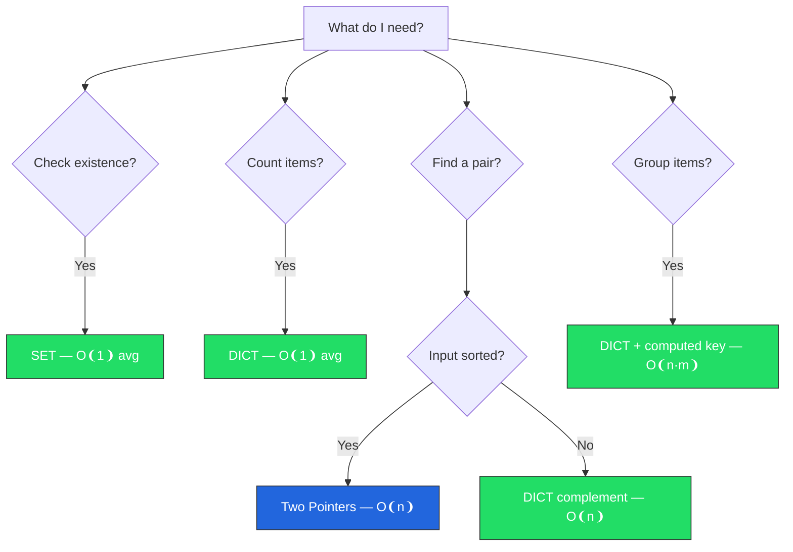
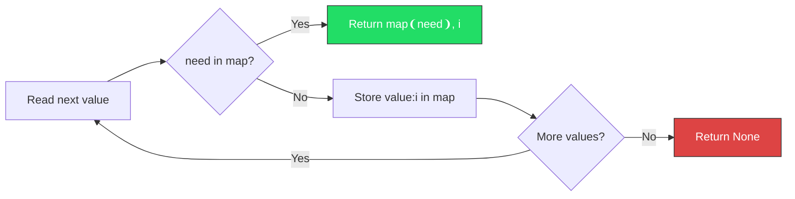

# Week 01 — Big-O, Arrays, Hashing Basics

> **TL;DR:** Week 01 builds the core habit of choosing the right data structure first. Arrays give compact sequential storage, while hash-based structures trade extra memory for faster average lookup. `code.py` shows how that tradeoff changes real solutions like duplicate checks, two-sum, and anagram grouping.

## Concepts

| Concept | What it does | Why it matters | Time / Space | `code.py` ref |
|---------|--------------|----------------|--------------|---------------|
| Big-O basics | Describes growth vs input size | Lets you compare solutions quickly | Depends on operation | module overview |
| Array scan | Check each element once | Baseline pattern for many problems | O(n) / O(1) | `contains_duplicate` |
| Hash set membership | Fast average contains check | Turns repeated scan into one pass | O(1) avg lookup | `contains_duplicate` |
| Hash map lookup | Stores value -> index or count | Core for two-sum and frequency tasks | O(1) avg lookup/update | `two_sum_indices`, `frequency_map` |
| Frequency signature | Normalize words by char counts | Robust anagram grouping | O(m) per word / O(1) signature storage | `anagram_signature` |
| Group by key | Bucket items by computed key | Reusable map pattern for clustering data | O(n) inserts / O(n) storage | `group_anagrams` |

## Big-O in practice

- Big-O helps estimate how runtime and memory grow as input size grows.
- We use it to compare approaches before implementation, especially when multiple solutions are correct.
- Example: Two-sum with nested loops is `O(n^2)`, while hash-map complement lookup is `O(n)` average time, so the hash-map approach scales better.

## Snippets

**One-pass duplicate check with a set** — stop as soon as a repeat appears.
```python
seen: set[int] = set()
for value in nums:
    if value in seen:
        return True
    seen.add(value)
return False
```
Expected output:
```text
contains_duplicate([1, 2, 3, 1]) -> True
contains_duplicate([1, 2, 3, 4]) -> False
```
Complexity: `Time O(n)`, `Space O(n)`.
Traversal (graphical):
```text
nums = [1, 2, 3, 1]
seen = {}
step1: read 1 -> not seen -> seen={1}
step2: read 2 -> not seen -> seen={1,2}
step3: read 3 -> not seen -> seen={1,2,3}
step4: read 1 -> already seen -> return True
```
> Hash-set membership removes the O(n^2) nested-loop pattern.

**Two-sum with complement lookup** — compute what you need, then query map.
```python
seen_index: dict[int, int] = {}
for idx, value in enumerate(nums):
    needed = target - value
    if needed in seen_index:
        return (seen_index[needed], idx)
    seen_index[value] = idx
```
Expected output:
```text
two_sum_indices([2, 7, 11, 15], 9) -> (0, 1)
```
Complexity: `Time O(n)`, `Space O(n)`.
Traversal (graphical):
```text
nums=[2,7,11,15], target=9
map={}
i=0 val=2 need=7  -> miss -> store {2:0}
i=1 val=7 need=2  -> hit  -> return (0,1)
```
> Store past values so each element is processed once.

**Frequency map pattern** — count occurrences in one pass.
```python
counts: dict[str, int] = {}
for item in items:
    counts[item] = counts.get(item, 0) + 1
```
Expected output:
```text
frequency_map(["api", "db", "api", "cache"]) -> {'api': 2, 'db': 1, 'cache': 1}
```
Complexity: `Time O(n)`, `Space O(k)` where `k` is distinct items.
Traversal (graphical):
```text
items = [api, db, api, cache]
counts={}
api   -> {api:1}
db    -> {api:1, db:1}
api   -> {api:2, db:1}
cache -> {api:2, db:1, cache:1}
```
> This pattern appears in logs, analytics, and anagram tasks.

**Anagram signature key** — same letters produce same key.
```python
counts = [0] * 26
for ch in word:
    counts[ord(ch) - ord("a")] += 1
return tuple(counts)
```
Expected output:
```text
anagram_signature("tea") == anagram_signature("eat") -> True
```
Complexity: `Time O(m)`, `Space O(1)` (fixed-size 26 array).
Traversal (graphical):
```text
word = "tea", counts[26]=all 0
t -> counts[t]+=1
e -> counts[e]+=1
a -> counts[a]+=1
signature = tuple(counts)
```
> Tuple keys are hashable and stable for dict grouping.

**Group words by computed key** — map signature -> list of words.
```python
groups: dict[tuple[int, ...], list[str]] = {}
for word in words:
    signature = anagram_signature(word)
    groups.setdefault(signature, []).append(word)
```
Expected output:
```text
group_anagrams(["eat", "tea", "tan", "ate", "nat", "bat"])
-> [['bat'], ['nat', 'tan'], ['ate', 'eat', 'tea']]
```
Complexity: `Time O(n * m)`, `Space O(n)`.
Traversal (graphical):
```text
words: ["eat","tea","tan","ate","nat","bat"]
sig(eat)->G1: [eat]
sig(tea)->G1: [eat, tea]
sig(tan)->G2: [tan]
sig(ate)->G1: [eat, tea, ate]
sig(nat)->G2: [tan, nat]
sig(bat)->G3: [bat]
sort groups -> [["bat"],["nat","tan"],["ate","eat","tea"]]
```
> Grouping by key is a reusable design in ETL and caching flows.

**Anti-pattern -> corrected pattern** — avoid nested loops when hash lookup works.
```python
# anti-pattern: O(n^2)
for i in range(len(nums)):
    for j in range(i + 1, len(nums)):
        if nums[i] + nums[j] == target:
            return (i, j)

# corrected: O(n) average using a dict
return two_sum_indices(nums, target)
```
Expected output:
```text
Both approaches can find a valid pair, but the hash-map version scales much better.
```
Complexity comparison: nested loops `O(n^2)` vs hash-map approach `O(n)` average.
Traversal (graphical):
```text
Brute force:
i=0 -> check j=1,2,3 ...
i=1 -> check j=2,3 ...
... many pair checks (triangle scan)

Hash-map:
single left-to-right scan
each step = compute need -> map lookup -> insert
```
> For large input, algorithm choice matters more than micro-optimizations.

## Visual / Diagram

### 1. Which data structure should I pick?

Read top-to-bottom. Ask yourself **one question at a time**.

```text
What do I need to do?
│
├─ "Check if X exists" ──────► use a SET    (avg O(1) lookup)
│
├─ "Count how many of X" ────► use a DICT   (avg O(1) update)
│
├─ "Find a pair that sums to target"
│   ├─ input sorted? ────────► Two Pointers (O(n), no extra space)
│   └─ input unsorted? ─────► DICT storing complement (avg O(n))
│
└─ "Group items by property" ► DICT with computed key (O(n·m))
```



### 2. Two-Sum — step-by-step walkthrough

Goal: find two indices whose values sum to `target = 9`.

```text
nums = [2, 7, 11, 15]
map  = {}                      (empty hash map: value → index)

Step 0: value=2, need=9−2=7    7 not in map → store {2:0}
Step 1: value=7, need=9−7=2    2 IS in map  → return (map[2], 1) = (0, 1) ✓
```



### 3. Anagram grouping — how words get bucketed

```text
Input: ["eat", "tea", "tan", "ate", "nat", "bat"]

Step 1 — compute a signature for each word (letter frequency → tuple):
  eat → (1,0,0,0,1,…,1,0,…)   ← 'a':1, 'e':1, 't':1
  tea → same tuple as eat       ← same letters!
  tan → (1,0,0,0,0,…,1,0,…,1) ← 'a':1, 'n':1, 't':1 (different)

Step 2 — group by signature key:
  key_1 → [eat, tea, ate]       (all have same letter counts)
  key_2 → [tan, nat]
  key_3 → [bat]

Step 3 — sort each group, then sort the list of groups:
  → [["bat"], ["nat","tan"], ["ate","eat","tea"]]
```

### 4. Complexity comparison

| Problem | Brute force | Optimal | Key insight |
|---------|-------------|---------|-------------|
| Contains Duplicate | O(n²) nested loop | **O(n)** set | Set membership is O(1) avg |
| Two Sum | O(n²) all pairs | **O(n)** dict | Store complement, check in one pass |
| Frequency Count | O(n²) manual compare | **O(n)** dict | `dict.get(k, 0) + 1` in one pass |
| Anagram Grouping | O(n·m·log m) sort key | **O(n·m)** freq key | Frequency tuple avoids sorting each word |

## Pitfalls

- Claiming hash lookup is always O(1); be precise: average-case O(1).
- Forgetting deterministic output order in grouped results, which makes tests flaky.
- Mixing algorithm logic with printing instead of returning testable values.

## Why this design

The reference code uses a progression from scan -> hash lookup -> grouping by signature. That progression teaches the main Week 01 habit: pick data structure and complexity target before coding details.

## Further reading

- [NeetCode Roadmap — Arrays & Hashing](https://neetcode.io/roadmap) — week-level problem direction.
- [Python docs — `dict`](https://docs.python.org/3/library/stdtypes.html#mapping-types-dict) — mapping operations and behavior.
- [Python docs — `set`](https://docs.python.org/3/library/stdtypes.html#set-types-set-frozenset) — set membership and uniqueness.
